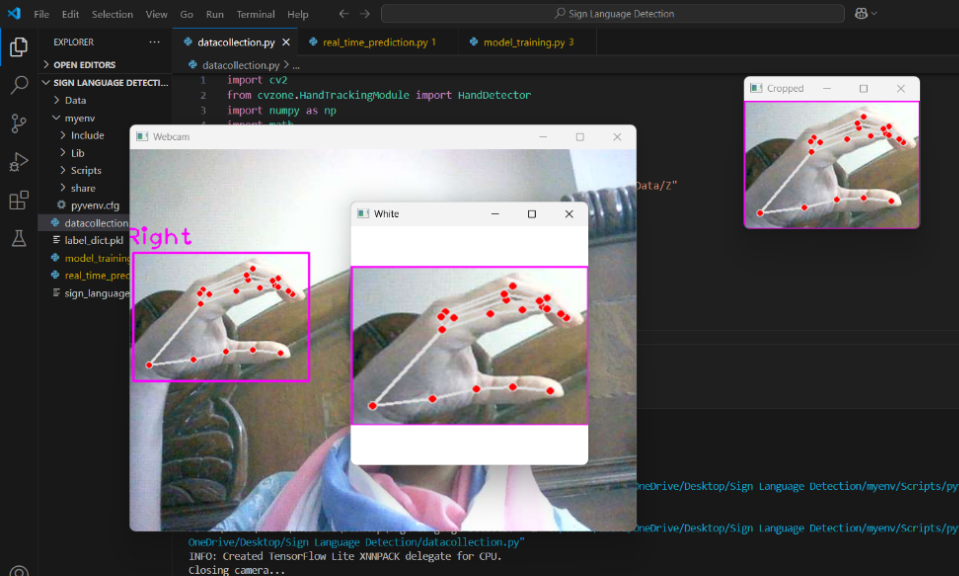
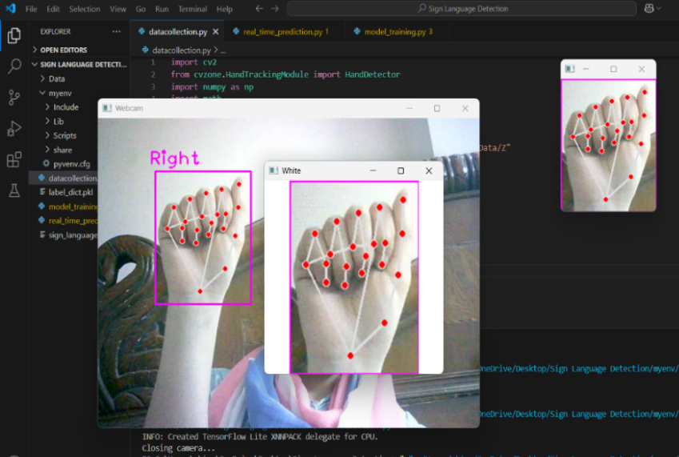
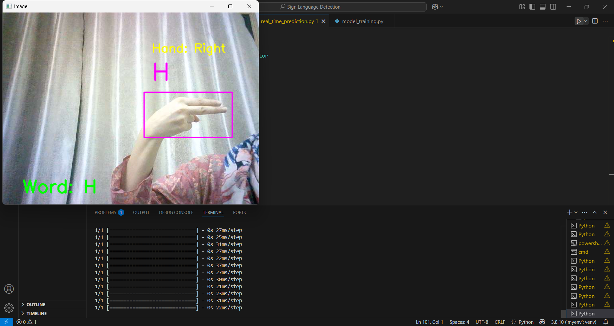
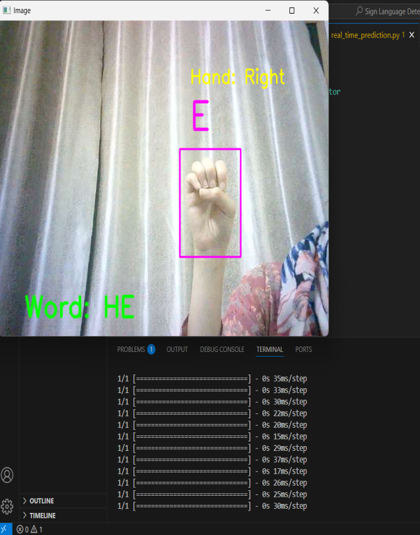
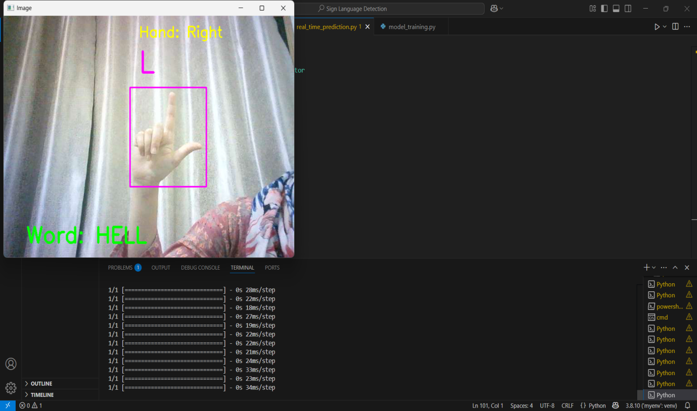
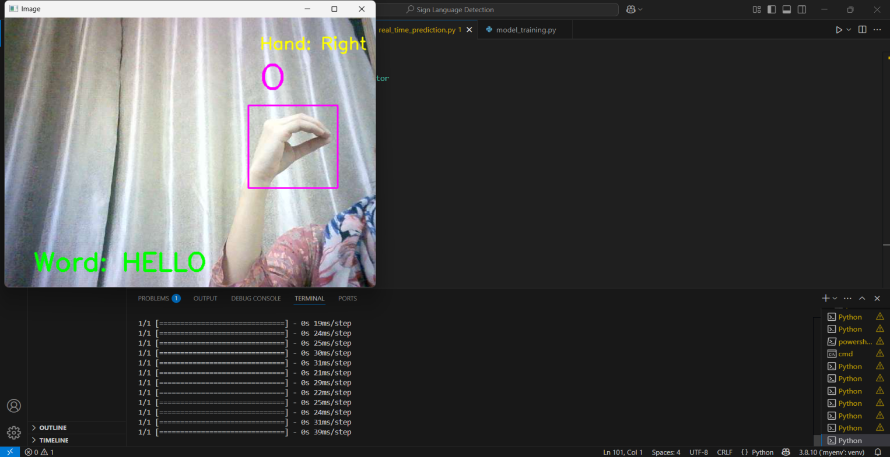
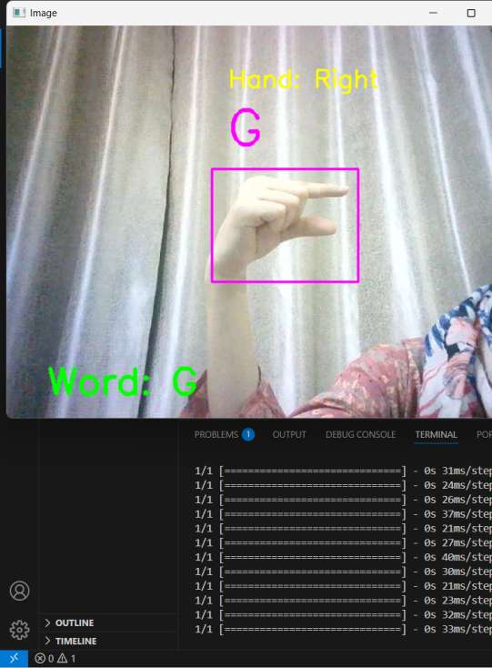
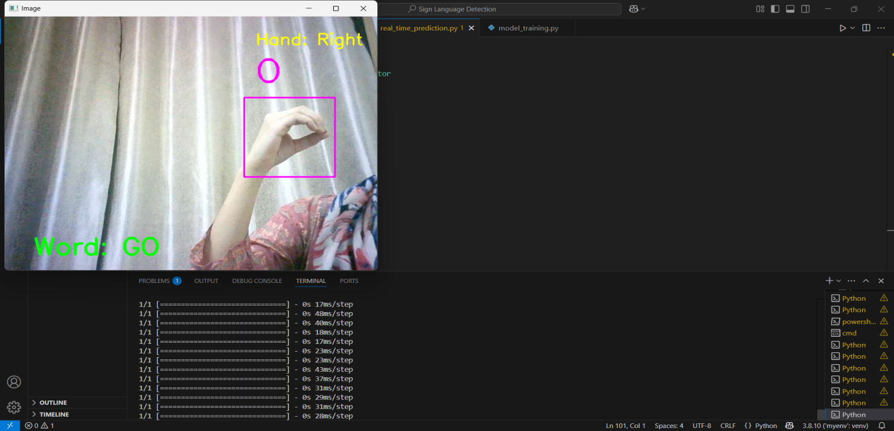

# 🤟 **AI Sign Language Translator**

This project is an **AI-based Sign Language Translator** that recognizes **hand gestures (A–Z)** in real time using a webcam and converts them into **letters and words** such as **HELLO** and **GO**.

```

## 📌 **Project Description**

The system uses **computer vision and deep learning** to detect hand gestures and predict corresponding alphabets.
Each detected letter is **highlighted on screen** and letters are combined step by step to form words.

This project is designed to support **basic communication** for the hearing and speech-impaired community.

```

## ✨ **Key Features**

* **Real-time hand detection using webcam**
* **Alphabet recognition (A–Z)**
* **CNN-based trained model**
* **Step-by-step word formation**
* **Hand type (Left/Right) detection**
* **Highlighted bounding box and predicted letter**

```

## 🛠️ **Technologies Used**

* **Python**
* **OpenCV**
* **MediaPipe**
* **TensorFlow / Keras**
* **NumPy**
* **cvzone**

```

## 📂 **Project Structure**

Sign Language Detection/
│
├── Data/                      # Dataset folders (A–Z images)
├── images/                    # Screenshots & demo outputs
├── data_collection.py         # Image collection using webcam
├── model_training.py          # CNN training script
├── real_time_prediction.py    # Live sign detection & word formation
├── label_dict.pkl             # Label mapping (index → alphabet)
├── sign_language_model.h5     # Trained model (local)
├── .gitignore
└── README.md

---

## 📊 **Dataset Information**

* The **Data/** folder contains **26 images (A–Z)**.
* Images were collected using a webcam under different angles and lighting.
* Dataset is used to train a **CNN model** for classification.

---

## 📸 **Data Collection Process**

Hand landmarks are detected and cropped before saving images.

**Image path:**

```
images/data_collection.png
```


---

## 🧠 **Model Training**

* **data_collection.py** → collects gesture images
* **model_training.py** → trains CNN on the dataset
* Model output:

  * **sign_language_model.h5** → trained model
  * **label_dict.pkl** → maps numbers to alphabets

The model predicts one alphabet at a time and outputs the most confident class.

---

## ▶️ **How to Run the Project**

1. Install required libraries:

   ```bash
   pip install opencv-python mediapipe tensorflow numpy cvzone
   ```

2. Run real-time prediction:

   ```bash
   python real_time_prediction.py
   ```

3. Show hand gestures in front of the webcam to see predictions.

---

## 📷 **Real-Time Output & Word Formation**

### 🔹 **Alphabet Prediction with Highlighted Hand**

The detected hand is **highlighted** and the predicted letter is shown clearly.

**Hand Landmarks:**

```
images/hand_landmarks.png
```





---

## 🔠 **Word Formation Example – HELLO**

**Step 1: H**

```
images/hello_h.png
```



**Step 2: E**

```
images/hello_e.png
```



**Step 3: L**

```
images/hello_l.png
```



**Step 4: L**

```
images/hello_l.png
```


**Step 5: O**

```
images/hello_o.png
```



✅ **Final Output:**
**HELLO**

---

## 🔠 **Word Formation Example – GO**

**Step 1: G**

```
images/go_g.png
```



**Step 2: O**

```
images/go_o.png
```



✅ **Final Output:**
**GO**

---

## 🚀 **Future Scope**

* Sentence-level translation
* Voice output for predicted text
* GUI or web-based interface
* Support for dynamic gestures

---

## 👩‍💻 **Author**

**Abirah Zaidi**

---
